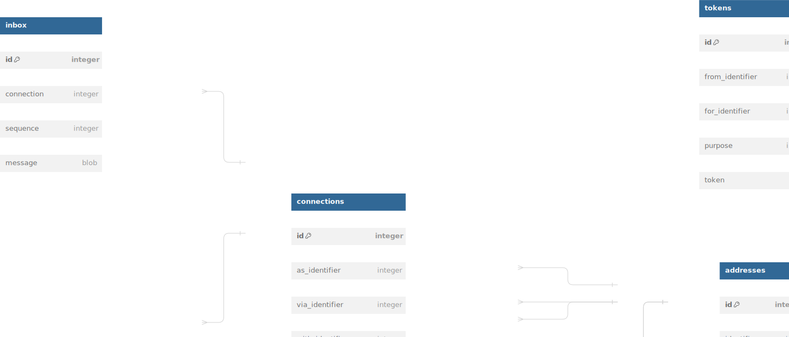

# Overview

Persistent storage is implemented via an embedded SQLLITE datebase, overlayed with an in memory cache sychronized through a coarse grained lock.

## Whats Implemented

- [x] basic transaction interface
- [x] simple caching

## Whats Missing

- [ ] database encryption
- [ ] transaction batches
- [ ] LRU caching

# Schema



## Tables & Relationships

### Identifiers

Holds records on persistent identities that have been witnessed or interacted with.

### Operations

Holds public key operations tied to persistent identifiers. It is linked to an identifier via it's autoincrementing primary key.

Clients will persist these operations forever (unless manually removed), to both improve lookup performance and to ensure clients can keep server responses honest.

When a client wishes to validate an operation signed by a key that's owned by a persistent account/identity, or to determine it's active keys/addresses, clients will first query their local records.

If there are no matches for the identitiy, or there are existing records that may be stale, the client will query the server for new records. The client will use it's existing state to validate the records returned by the server. Once validated, these new operations will be added to the clients local cache/database.

As clients persist these operations, it allows them to validate that the server is being honest about the records it returns. If the server produces new operations that depend on tampered history that the client has already witnessed, signautures and previous hashes will not match, allowing clients to mark servers as compromised/untrustworthy.


### Identifiers

Holds records of public key address identifiers that have been witnessed or interacted with. 

This is essentially the main table, as public keys serve as an address by which things are routed and entities are connected, etc.

### Keypairs

Holds records of private keys and any corresponding e2e encryption accounts. 

The clients account will use this table to retrieve keys to sign messages or state, create new prekeys or establish new sessions via the associated olm account.

### Connections

Holds records of other identifiers/addresses that the account has mutually connected with, including membership to groups.

### Sessions

Holds records of e2e encrypted sessions with other public key addresses.

When sending or receiving a message, this table will be used to encrypt or decrypt a message via the olm session, and to track recevied and sent sequence numbers.

### Tokens

Holds records of tokens issued by other public key addresses for the purpose of interacting with or proving authorization to an action

### Credentials

Holds records of attested credentials that are either issued for or have been shared with the account

### Inbox

Holds an ephemeral queue of messages that have been recieved and are waiting to be processed by the implementing client

### outbox

Holds an epehemeral queue of messages that are scheduled to or have been sent to the server, but have not yet been acknowledged

## Access Patterns and Transactionality

### Message Send

1. look up group in cache
2. look up group from DB (optional, if not found in cache)
3. look up group members from DB (optional, if not found in cache)
4. look up sessions for each group member (optional, if not found in cache)
5. encrypt message
6. create transaction
7. update each group members session state
8. update sequence_tx for each group/member
9. insert encrypted message into outbox
10. commit transaction

### Message Acknowledged
1. remove message from outbox

### Message Received

1. look up group in cache
2. look up group from DB (optional, if not found in cache)
3. look up group members from DB (optional, if not found in cache)
4. look up sessions for each group member (optional, if not found in cache)
5. decrypt message
6. create transaction
7. update each group members session state
8. update sequence_rx for the sender
9. insert decrypted message into inbox
10. commit transaction

### Message Processed
1. remove message from inbox

## DBML

```ruby
# Use DBML to define your database structure
# Docs: https://www.dbml.org/docs

Table identifiers {
  id integer [primary key]
  identifier blob
}

Table keypairs {
  id integer [primary key]
  for_identifier integer
  role integer
  keypair blob
  olm_account blob
}

Table operations {
  id integer [primary key]
  on_identifier integer
  sequence integer
  operation blob
}

Table metrics {
  id integer [primary key]
  as_identifier integer
  with_identifier integer
  sequence_tx
}

Table connections {
  id integer [primary key]
  as_identifier integer
  via_identifier integer
  with_identifier integer
  connected_on integer
}

Table sessions {
  id integer [primary key]
  as_identifier integer
  with_identifier integer
  sequence_rx integer
  sequence_tx integer
  olm_session blob
}

Table tokens {
  id integer [primary key]
  from_identifier integer
  for_identifier integer
  purpose integer
  token blob
}

Table credentials {
  id integer [primary key]
  from_identifier integer
  about_identifier integer
  credential blob
}

Table inbox {
  id integer [primary key]
  session integer
  sequence integer
  message blob
}

Table outbox {
  id integer [primary key]
  session integer
  sequence integer
  message blob
}

Ref: keypairs.for_identifier > identifiers.id
Ref: operations.on_identifier > identifiers.id
Ref: connections.as_identifier > identifiers.id
Ref: connections.via_identifier > identifiers.id
Ref: connections.with_identifier > identifiers.id
Ref: sessions.as_identifier > identifiers.id
Ref: sessions.with_identifier > identifiers.id
Ref: credentials.from_identifier > identifiers.id
Ref: credentials.about_identifier > identifiers.id
Ref: tokens.from_identifier > identifiers.id
Ref: inbox.session > sessions.id
Ref: outbox.session > sessions.id
```